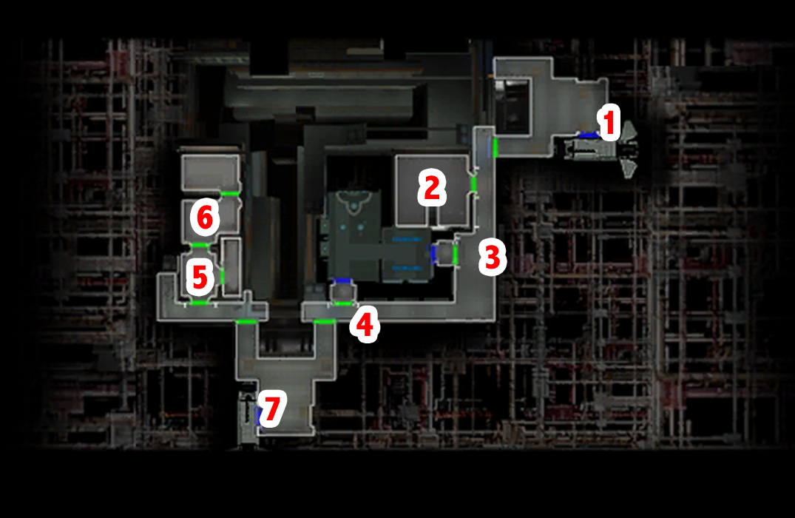

# Telos - Getting our equipment back

[< Previous Page](./02_Telos.md) |
[Back to the Index](../index.md) |
[Next Page >](./04_Telos.md)

- Sullustan
    - What's going on here?
    - How do you plan on doing that?
    - I'd like to hear his side of the story.
    - I think you should leave now.
    - Can't we talk about this?
    - I don't want to fight you. `a_givelight(3)`
- Fight
    - Why are they allowed to do this?
    - You should leave in case their friends come looking for them.
    - **Keep your credits, a reward is not necessary.** `a_givelight(3)`
- 6 light side points!
  - Movie triggers -> Visa felt your alignment (sometimes after the fight)
  - [FUN TEST] at the end of the movie -> fade in with PC -> try save before loading
- Transit console
- See TSF droid
  - Lt. Grenn said to come here to get the Ebon Hawk and the rest of my possessions out of impound.
  - Stolen? How is that even possible?
  - **Was there anything in the system about our ship?**
  - What am I supposed to do now?
  - Tell me about the Exchange.
  - Isn't there anything more the TSF can do?
  - **Can I get my possessions back at least?**
  - I'll be going now. [End Dialog]
- Loot but don't equip yet
- Grenn
  - How will you recover from the destruction of the Peragus mining facility?
    - How bad?
    - **Can't the Republic increase funding for the Station?**
    - Is there anything that can be done?
    - If I can help, I'd like to.
    - Still think I'm to blame?
- Console (202trmt)
  - Enter a random name and password.
  - [Computer] Attempt to slice a user name and password.
  - **Check the status of nearby vessels.** -> republic ship delayed...
  - Access pending investigations.
  - Peragus Mining Facility inquiry.
  - Access Ebon Hawk records.
  - [Computer] Attempt to recover the lost data.
  - Log out. [End Dialog]
- Re-ask Grenb
    - Do you have any work I could do?
    - Tell me about the bounties.
    - Tell me about Batono.
        - Why do you need my help? This sounds like something the TSF should investigate.
        - **So you need me to clean up your mess?**
        - A little guilt on your conscience?
        - Do you have any leads?
        - I'll see what I can dig up.
        - I have some other questions about the bounties.
    - Tell me about the criminals.
        - **Do you think someone was behind their escape?**
        - What do you know about the criminals?
        - I'll see what I can dig up.
        - I'd like to talk to you about another bounty.
    - Tell me about Batu Rem.
        - **Are you sure that wasn't the real Batu Rem?**
        - Is there any way to find out about the killer's movements on the station?
        - I'll see what I can dig up.
    - I'll be going now. [End Dialog]

[< Previous Page](./02_Telos.md) |
[Back to the Index](../index.md) |
[Next Page >](./04_Telos.md)
