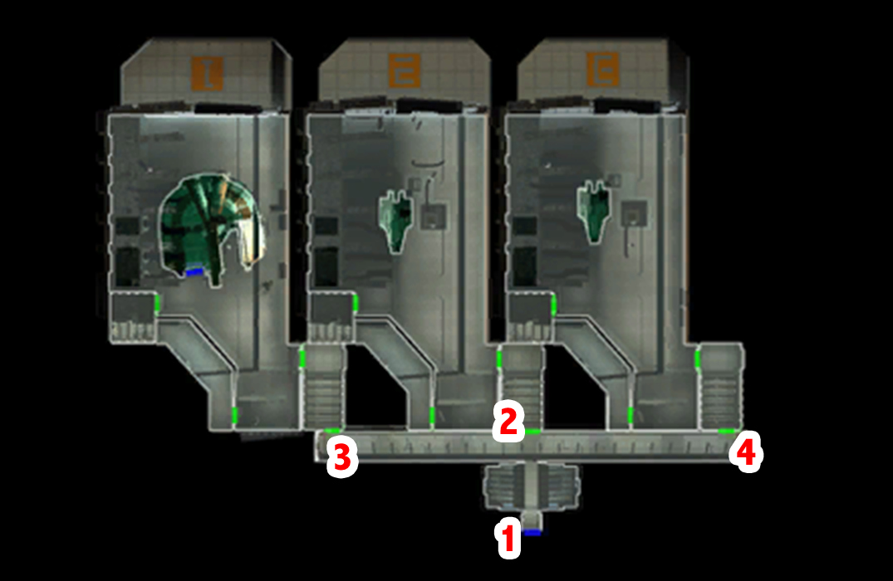

# Telos - The docking area

[< Previous Page](./03_Telos.md) |
[Back to the Index](../index.md) |
[Next Page >](./05_Telos.md)

- Go to dock module
- Transit system
- Ithorian
    - What's in this bay?
    - "Normally?" What's it being used for now?
    - Why is that?
    - I'll be going now. [End Dialog]
- Left -> 1rd bay -> TSF -> Ebon Hawk
- Protocol droid in the coridor
- Civilian -> wait for flight to Taris for 5 years lol
- Right (3rd docking bay)
- Twilek
    - I'm looking for a man named Batono.
    - You don't know? But he oversaw these docks.
    - Czerka employee? Then you do know Batono.
    - I'll be going now. [End Dialog]
- Duros
    - What goes on here?
    - I'd like some information about a passenger that came through here.
    - Your confidentiality is protecting a killer.
    - He left no other evidence.
    - [Persuade] Don't worry, I'll be discrete with my inquiries. The killer is dead, anyways.
    - How much would this expense be?
    - Twenty-five credits it is, then.
    - Batu Rem.
    - I'll be going now. [End Dialog]
- Transit back to residential

[< Previous Page](./03_Telos.md) |
[Back to the Index](../index.md) |
[Next Page >](./05_Telos.md)
