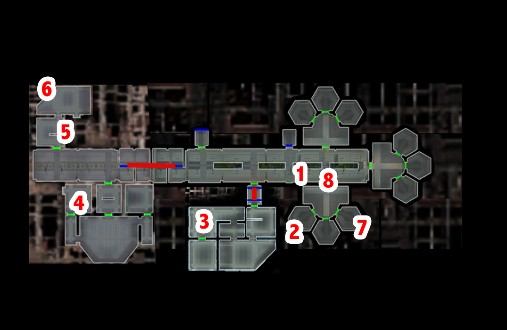

# Telos - Batono

[< Previous Page](./04_Telos.md) |
[Back to the Index](../index.md) |
[Next Page >](./06_Telos.md)

- Go to your appartment
- Equip back your stuff
- Talk to Atton (can be weird as he taks about "the others have noticed it, too." -> only Kreia for the moment...)
  - What do you mean?
  - I feel as if I'm more in touch with the Force than I ever have been.
- Go to Czerka -> Batono
- Jana Lorso -> she talks with the two assasins we are looking for! (-> without TSLRCM -> first conv) (rodkill.dlg)
  - Wait! You're the criminals the TSF is hunting for.
- Talk to Jana Lorso
  - Does the name Batono mean anything to you? (BUG -> can't ask that anymore now)
  - He's gone missing, do you have any idea where he might have gone?
  - Grenn and the TSF are looking for him. He asked me to find him.
  - A reward?
  - How much?
  - How would you put an end to his investigation?
  - How would you convince him to abandon his investigation, then?
  - I will tell you if I find him.
- Leave the office
- Ithorians
- Reask
  - Do you know anything about a man named Batono?
  - I thought you might know of him, given his dislike of Czerka.
  - Are you sure? Lorso mentioned that he spent time here in the compound.
  - [Persuade] I'm looking for him on behalf of Lieutenant Grenn. If I can locate him, it might prove the end of Czerka.
  - I give you my word, Chodo.
  - I'll be going now. [End Dialog]
- Go see the diplomat -> LATER -> can't open the conainer
  - Who are you?
  - Why are you here?
- Open container with Atton + Security equiped bonus
- Go see Batono
  - What's CSD?
  - Just looking around.
  - Sorry, I'll leave you alone.
- Reask
  - You're Batono, right?
  - Lieutenant Grenn sent me to look for you.
  - If you don't come forward, I'll turn you in to Lorso.
  - That's why you should come forward.
  - If it's your safety you're worried about, you shouldn't. After Czerka is exposed, they won't dare to move against you.
  - The TSF can put you under its protection.
  - Do you want to live in fear for the rest of your life?
  - I know better than you think. The only way you can protect yourself is to strike back.
  - TSF officers patrol the modules, I don't think you have much to worry about.
  - Come with me.
- Protect (mercbat.dlg)
  - Lorso isn't taking Batono anywhere.
- Fight
- Get TP to Grenn
  - I hate to interrupt this reunion, but if there's nothing else, I should be going.
- Talk to Grenn again
  - I'd like to talk to you about the bounties.
  - I have some information about the escaped criminals.
  - What's this information worth to you?
  - They've escaped Citadel Station.
  - The criminals made a deal with Jana Lorso to be smuggled to the restoration zones.
  - I was there when it happened.
  - I'll be going now. [End Dialog]
- Head toward the docking bay

[< Previous Page](./04_Telos.md) |
[Back to the Index](../index.md) |
[Next Page >](./06_Telos.md)
