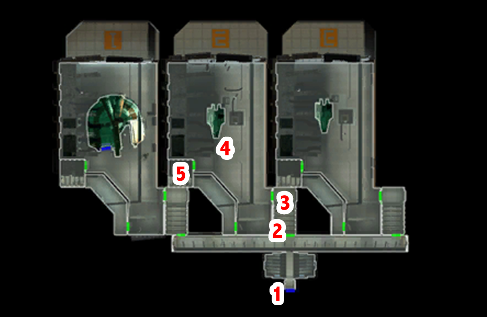

# Telos - Droid delivery

[< Previous Page](./05_Telos.md) |
[Back to the Index](../index.md) |
[Next Page >](./07_Telos.md)

- Meet
- Kill
- Loot
- Talk
- Chodo TP
- Exchange guard
- Go to your appartment
- Remove Atton from the group (DSP propagate to party members)
- Go to Sleep
- Kreia (light side)
    - There is enough suffering in the galaxy - if I can alleviate for one person, then I have made a difference.
    - I fail to see how small acts of mercy can be harmful. (-> don't be to hard on Kreia?)
    - Then I shall view you as disposable, then. (+1DSP!!! but +1 infl on Kreia -> more important)
    - Never mind. I'll be going now. [End Dialog]
- Bring Atton back

[< Previous Page](./05_Telos.md) |
[Back to the Index](../index.md) |
[Next Page >](./07_Telos.md)

