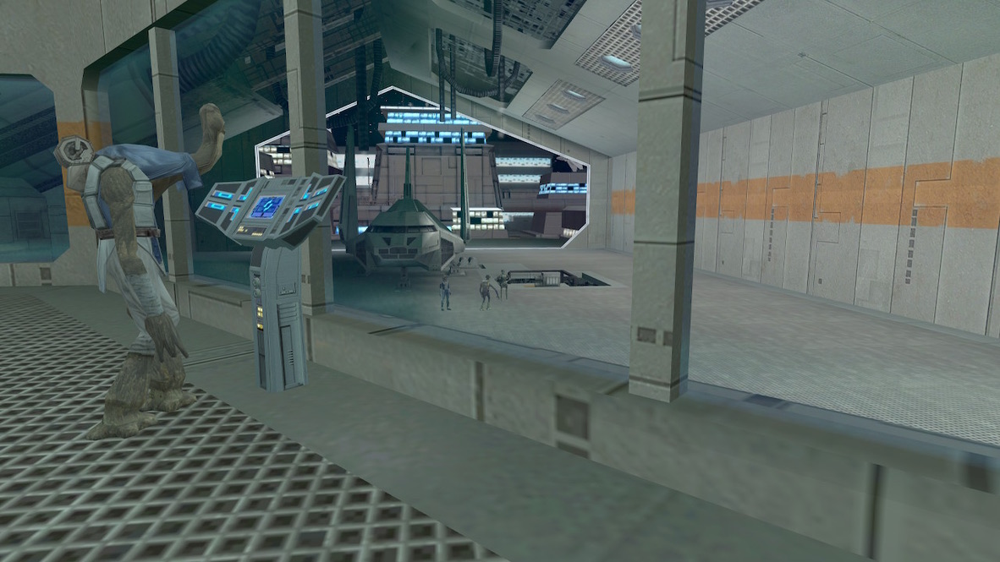
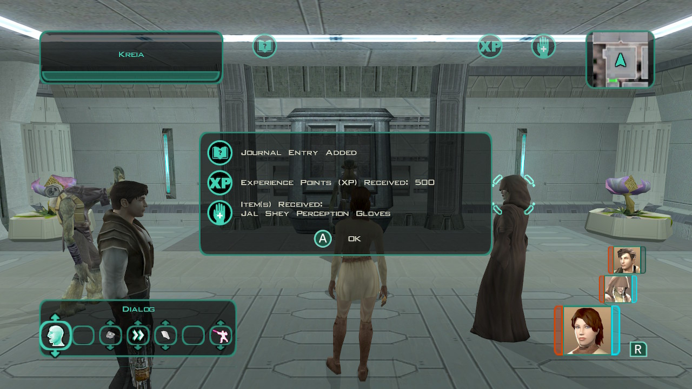

# Telos - Droid delivery

[< Previous Page](./05_Telos.md) |
[Back to the Index](../index.md) |
[Next Page >](./07_Telos.md)

- Speek to the Ithorian (201ithd.dlg)
  - Chodo Habat sent me to help deliver the replacement restoration droid.
- (nothing to loot before)
- Meet

- Kill (201ithd2.dlg)
  - **[Awareness] It looks as though the blaster has been heavily modified.** `c_sc_awa_gt(5)`
  - Yes, I'll get the droid back to the Ithorians right away.
- Loot
  - Pack de force (e_imp1_04)
  - Armure de néophyte Jal Shey? (a_robe_07)
- Talk to TSF
- Talk to the droid (201drdi.dlg)
  - Yes, follow me to the Ithorian Compound.
- Chodo TP
  - I found this blaster on one of the assailants.
  - **Is there anything else I can do to help you?**
  - Czerka and the Exchange must be stopped.
  - **I told you, I'm not a Jedi.**
  - I'll go speak with him.
- Gives Jal Shey gloves!

- Exchange guard
- Czerka office
- B-4D4
  - Is this blaster of Czerka make?
  - Why would a Czerka weapon be in the hands of an assassin?
  - I'll be going now.
- Kreia intercept you (203kreia.dlg)
  - **I don't need your approval, Kreia.**
  - **I don't sense he intends to do us harm.**
  - Perhaps you are right, Kreia. But we need his help, at least for the time being.
- Go to your apartment
- Remove Atton from the group (DSP propagate to party members)
- Go to Sleep
- Talk to Kreia (light side)
    - There is enough suffering in the galaxy - if I can alleviate for one person, then I have made a difference.
    - I fail to see how small acts of mercy can be harmful. (-> don't be to hard on Kreia?)
    - **Then I shall view you as disposable, then.** `a_influence_inc(6, 1)&&a_givedark(1)` -> influence is very important!
    - Never mind. I'll be going now.
- Transit back to the Entertainment module

[< Previous Page](./05_Telos.md) |
[Back to the Index](../index.md) |
[Next Page >](./07_Telos.md)

