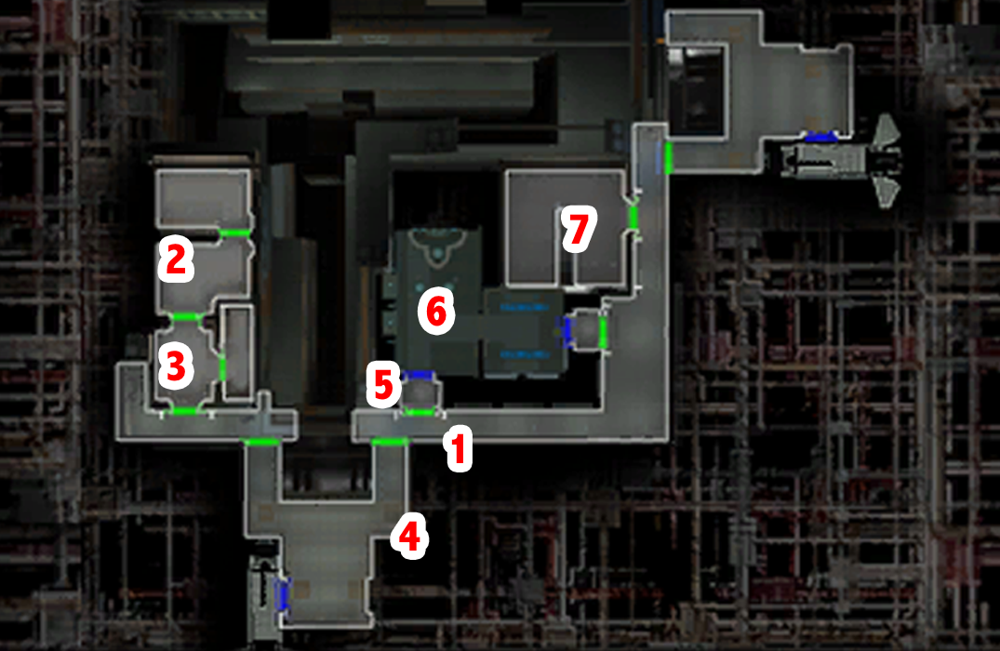

# Telos - Investigating the modified blaster

[< Previous Page](./06_Telos.md) |
[Back to the Index](../index.md) |
[Next Page >](./08_Telos.md)

- Bring back Atton to your group (he has gone to the cantina while you slept :p )
- To Grenn
  - **I have a blaster I'd like you to look at.**
  - I was ambushed by thugs in a dock module. One of the attackers was carrying this.
  - **Disturbing? There are plenty of armed people on Citadel Station.**
  - **You've found more evidence previously?**
  - Perhaps I could help you find the source of these goods.
  - I'll see what I can do.
- TSF droid -> when Sojourn delayed?
  - Do you know why the Sojourn has been delayed?
  - I'll be going now. `a_spawnzhug()`
- Duros attack -> bug on switch -> appearance of a black republic general... (Masked Attacker)
- Go to Cantina?
- Ask droid -> entertainment
  - What sort of entertainment do you have here?
- pass near Benok
  - **I'm no Jedi.**
  - Can I help you?
  - Someone with an inflated view of himself?
  - She's right. Mess with me and you're dead.
- Luxa
  - **Can you tell me anything about this blaster?** `a_set202luxa(1)` -> `202TEL_Luxa = 1`
  - **Thanks anyways.** `a_set_202luxab()` -> `202TEL_Luxa_Blaster = 1`
  - **That's a list of my favorite things.**
  - What does this have to do with me?
  - [Lie] Yes, I'm a Jedi.
  - What does this have to do with anything?
  - What's your problem with Slusk?
  - I'm not killing your boss for you.
  - It was an Exchange ship?
  - No, I won't do it.
  - How would this work?
  - It's a deal.
- Near Onderon people
- Pazaak x3 times -> earn card x2
- Swoop (SAVE)
  - 41 sec
  - What's my prize? -> +500c
- SAVE
- Corrun Falt (207TEL.mod\207falt.dlg)
  - What do you do at Czerka?
  - What can you tell me about Czerka?
  - "Telos thing?" You mean the planet restoration?
  - How does Czerka profit from the restoration project?
  - Tell me about Lorso.
  - Sounds like you're a little jealous.
  - I'll be going now.
- Doton Het (207TEL.mod\dotonhet.dlg) -> should have 1000c in hand
  - Who are you?
  - Odds and ends?
  - Could I look at your inventory?
  - I've come on behalf of Harra.
  - Give me the girl, or I kill you. -> or better? -> possible (203TEL_Harra == 4): "I guess I'll leave it to them to change your mind." ?
  - You'll be dealing with my blaster.
  - How much do you want for her?
  - How about you wager her on a game of pazaak?
  - 1000 credits it is.
- Win
  - I am taking you back to Harra.
  - Let's go.
- Back to residential (203TEL.mod\ramana.dlg)
  - You're free now, Ramana, you can go with Harra. `a_lightsml()`
  - Then you can do whatever you wish.

Level up Kreia & Atton lvl 9

- Back to the 082
  - Dobo store SAVE BEFORE ANY CONVERSATION -> maybe start with Shamham -> for cheaper things to buy first
    - Determine Dendis inventory. (LS - will give you a price) Aim for:
      - (Robe) Jal Shey Neophyte Armor (very good and pretty cheap) or Jal Shey Advisor Armor but 1300
      - (Medium) Sith Battle Suit for Atton
    - Determine Shamham (more important for DS)
      - Unarmed Accuracy Gloves -> for later on telos 1100c
      - Exchange Work Gloves -> 650c
      - Matukai Apprentice Robe for Kreia VERYYYY EXPENSIVE! 4000c
  - Dendis
    - What can you tell me about this blaster?
  - Shamham
    - What can you tell me about this blaster?
    - **I think there's something you're not telling me.**
    - I want to know who sold the weapon I was attacked with.
    - Perhaps you should be more careful about who your weapons are purchased by.
    - Do you know anything about the smuggling operation on the Station?
    - **Are you an idiot? You just incriminated yourself. I'll report you to the TSF.**
    - How is Czerka involved?
    - I'll be going now.
  - Go back to see Grenn
    - Samhan Dobo is the source of the black market goods on Citadel Station.
    - **Why don't you just seize his possessions and place him under arrest?**
    - Is there anything else I should know? `a_global_set("200TEL_Sting", 6)`
  - Back to Samhan
    - I've decided I want to work for you.
    - **I expect the pay is good.**
    - What can I do for you?
    - **Why do you ask?**
    - Other uses?
    - **What is it you need?**
    - Do you have any suggestions?
    - I'll be back when I have them.
- Make Atton and Kreia leave the group (at the apt)
- Go to the Ithorian compond (not necessary in the end, but fun)
  - Vivarium
    - **Could you tell me which is the bachani plant?**
    - ... reask
    - I'm here to collect some plant specimens.
    - [Persuade/Lie] Lieutenant Grenn is concerned that some of these plants are in violation of Republic trade laws. He asked me to procure some samples for him. `c_sc_per_gt(6)`
  - Take the sample
    - You take a sample of the plant. `a_global_set("200TEL_SmugglingM1", 2)`
  - Reactivate the protection with the computer
- Back to 081
  - CANCELED: these lines prevent Grenn `a_tsfsmugclose()`
    - Shamhan - 1 DSP
      - **I have the bachani plant sample from the Ithorians.** `a_givecredits(300)` + `a_givedark(1)`
      - How will you get the sample off the station?
      - Do you have more work for me?
      - As long as I will be well paid.
      - I'll be back with the shield. 
  - Go back to Grenn
    - Samhan wants me to get three things for him, then he'll make a shipment. `a_give_item("grenn_case", 1)`
    - Leaves from the Ithorians' bachani plant, their prototype shield unit, and medical supplies.
    - Sounds pretty dangerous. Just remember that when it's time for my fee.
  - Shamhan
    - I've got the items you were looking for.
    - I have some preparations to make first.
  - Equip an reask
    - I'll escort you...
  - Teleported
    - I'm just glad to be rid of this scum.
  - Back to 081
    - **It was necessary to remove this criminal.** `a_givecredits(500)`
  - +150 XP + 1 LSP
  - BAck to his brother Dendis -> make you a price!
    - Buy 
      - Jal Shey Neophyte Armor -> `540c`
      - Sith Battle Suit -> `1170c`
  - Upgrade
    - Looted Zabrak
      - Create `Improved Mullinine Edge` Repair >= 16
      - `Advanced Agrinium Grip` Repair >= 14 `30 comp`
      - Energy Shielding Mark II

- Prepare for the exchange assault
  - Go to workbench at Opo Chano shop
    - Kreia (+belt for Treat Inj)
      - Strenghthening Underlay Mark III (+1 constitution, +2 strength) -> too much components...
    - Meetra
      - Against blugde...
- Exchange
  - I'm here representing Chodo Habat.
  - Then how do I set up an appointment?
  - She wants to have him killed.
  - Luxa sent me.
- SAVE before entering

[< Previous Page](./06_Telos.md) |
[Back to the Index](../index.md) |
[Next Page >](./08_Telos.md)
