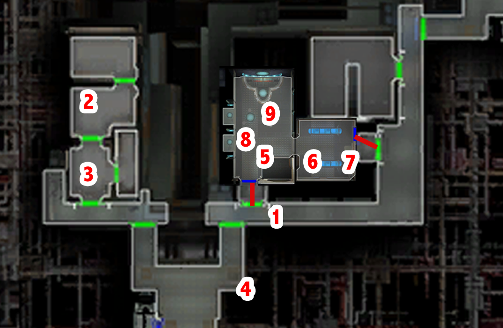

# Telos - Investigating the modified blaster

[< Previous Page](./06_Telos.md) |
[Back to the Index](../index.md) |
[Next Page >](./08_Telos.md)

- Bring back Atton to your group (he has gone to the cantina while you slept :p )
- To Grenn
  - I have a blaster I'd like you to look at.
  - I was ambushed by thugs in a dock module. One of the attackers was carrying this.
  - Disturbing? There are plenty of armed people on Citadel Station.
  - You've found more evidence previously?
  - Perhaps I could help you find the source of these goods.
  - I'll see what I can do.
- TSF droid -> when Sojourn delayed?
  - Do you know why the Sojourn has been delayed?
  - I'll be going now. [End Dialog]
- Duros attack -> bug on switch -> appearance of a black republic general... (Masked Attacker)
  - Loot: Armure d'initié Zeison Sha (a_robe_06)
- Level 10
- Go to Cantina? -> Benok location?
- pass near Benok
  - I'm no Jedi.
  - Can I help you?
  - Someone with an inflated view of himself?
  - She's right. Mess with me and you're dead.
- Luxa
  - Can you tell me anything about this blaster?
  - So, what did you want?
  - That's a list of my favorite things.
  - What does this have to do with me?
  - [Lie] Yes, I'm a Jedi.
  - What does this have to do with anything?
  - What's your problem with Slusk?
  - I'm not killing your boss for you.
  - It was an Exchange ship?
  - No, I won't do it.
  - How would this work?
  - It's a deal.
- Ask droid -> entertainment
- Swoop (SAVE)
  - 41 sec
  - What's my prize? -> +500c
- Pazaak x3 times (or x4?) -> card x2
- Near Onderon people
- Corrun Falt (207TEL.mod\207falt.dlg)
- Doton Het (207TEL.mod\dotonhet.dlg)
- Back to residential (203TEL.mod\ramana.dlg)
- Exchange

[< Previous Page](./06_Telos.md) |
[Back to the Index](../index.md) |
[Next Page >](./08_Telos.md)
