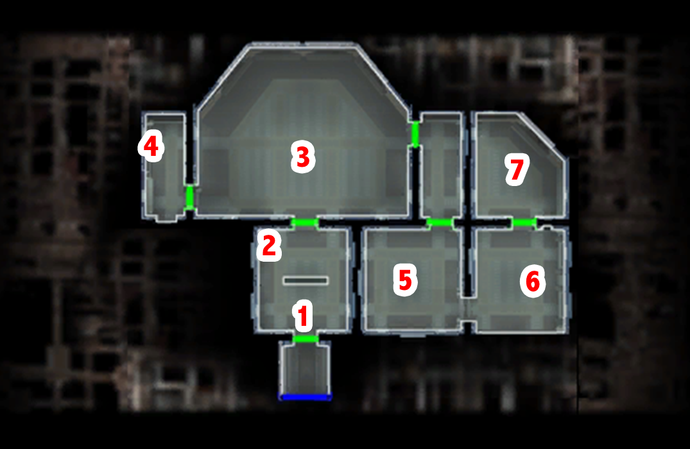

# Telos - Bumani exchange cleanup

[< Previous Page](./07_Telos.md) |
[Back to the Index](../index.md) |
[Next Page >](./09_Telos.md)

- Meet Vula (208tel.mod/203vula.dlg)
  - I didn't have an appointment. -> triggers Gamorean fight
- 3 gamoreans + boss
- Ithorian prisoner (208tel.mod/ith_pris.dlg)
  - No, why are you here?
  - How do I set you free?
  - I'll see what I can do. [End Dialog]
- Lopak call
  - I'm not a Jedi.
  - Wait - aren't I worth more alive?
  - I just want my ship back.
  - The Ebon Hawk? Luxa said you stole it.
- Kill Gamo (1st group)
- [Loot lvl 10 -> 5 to 12 + 17](http://assiste.free.fr/kotor_2/040_telos_citadelle_diplomatie_ithorienne_bumani_echange_luxa_loppak_slusk.html#mort_de_bennok_et_sa_bande)
  - Gantelets de puissance Sith (a_gloves_17)
- Gamorean guard -> opens Loppak's office
- 2 droids
- Loppak Slusk
  - I just want you to leave the Ithorians alone.
  - Can't we talk about this, come to an agreement?
  - I'm going to turn down your offer, Slusk. Goodbye.
- Kill him with 2 turrets
- Luxa
  - The Exchange off Citadel Station, or you'll be joining Slusk soon.
  - Where's my ship, Luxa?
  - I think you might be overestimating your chances.
- Kill her and guards
- Atton
  - Changed your mind, Atton?
  - You're as much a part of this as I am.
- [Slusk loot lvl 10 -> 5 to 12 + 17](http://assiste.free.fr/kotor_2/040_telos_citadelle_diplomatie_ithorienne_bumani_echange_luxa_loppak_slusk.html#mort_de_luxa_et_sa_bande)
  - CNS Strength Enhancer (a_belt_15)
  - Fusil lourd à répétition (w_brifle_17)
  - Pistolet lourd arkanien (w_blast_11)
- [Luxa loot lvl 10 -> 5 to 12 + 17](http://assiste.free.fr/kotor_2/040_telos_citadelle_diplomatie_ithorienne_bumani_echange_luxa_loppak_slusk.html#diplomatie_ithorienne)
  - Pack-D d'augmentation (e_imp4_04) -> levelItem 18 -> no
- Console -> free the Ithorian (bug?)
- Leave the office

[< Previous Page](./07_Telos.md) |
[Back to the Index](../index.md) |
[Next Page >](./09_Telos.md)
