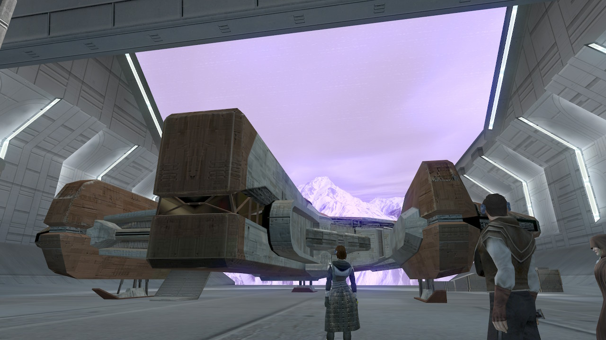

# Telos - Crash landing on the surface of the planet

[< Previous Page](./12_Telos.md) |
[Back to the Index](../index.md) |
[Next Page >](./14_Telos.md)


- HK-50 the welcome comitee
  - Any reason why you shot down my vessel?
  - What are you assassin droids doing here?
  - How many of you are there?
  - Destroying one of you was easy... wiping out three of you might cause me to break a sweat.
- CAREFUL kill droid mines before explode -> 25XP
- Bao -> unconscious

CHECKS
- **Awareness >= 15 && Persuade >= 4**
- Equip if necessary

- Enter the base
- Echani sisters take Bao
- Echanis welcome you
  - Who are you?
  - If they wish a fight, I will give them one.
  - **Very well. I did not come here to do battle.** `a_givelight(1)`
- Kreia and Atton talk
  - `a_meddooropen()` `a_262walkatris()` `a_262walkatris(1)&&a_forcecage_cs()`
- Atris
  - **Tell me what you've done with my friends first.**
  - **It was not my intention to come here, Atris - or see you again.** -> stolen our ship
  - **The Force brought me here.**
  - Refresh my memory - why did the Council cast me out?
  - But the Republic asked the Jedi for aid.
  - **My punishment could have been worse. For that, I am grateful.** `a_global_inc("262TEL_Atris_Response", 1)`
  - **That's my lightsaber!**
  - If I became a Jedi again, would you return it to me?
  - **I had no other choice but to go to war!**
  - **I went to war to protect others, not for battle.** `a_global_inc("262TEL_Atris_Response", 1)`
  - Is the Jedi way to let people be massacred?
  - **Revan and Malak turned on you, not I.**
  - Then you know nothing of what drove me... or Revan.
  - So you were content to let the Outer Rim die? For the sake of teachings?
  - **We could have waited, but defeating the Mandalorians after they had won would have been difficult.**
    - There are victories other than physical ones. The real victory lay in th-{"the decision of the Council."}
  - **...the triumph of pacifism? Surrender?**
  - Your words would have rung hollow if the Mandalorians had crushed the Republic and conquered the galaxy.
  - Oh, please. Anyone who stepped outside the Jedi Archives would know it.
  - **[Awareness] Your anger... is it because you secretly wish you'd had the strength to follow me to war?** `c_sc_awa_gt(14)`
  - **I can see it in you - you wanted to fight by my side. But you were too scared to defy the Council.**
  - I'm here because a pretentious schutta stole my ship.
  - **Look, do you have my ship or not?**
  - Good luck with the navicomputer - you're wasting your time. `c_sc_rep_gt(0)`
  - **All the miners were already dead!**
  - **The Ebon Hawk isn't yours, Atris. Return it.**
  - **I admit nothing.**
  - **I know it put Telos in jeopardy, but I had no choice.**
  - What do you mean?
  - **You know me - and know I would not have intentionally committed such an act.** `a_global_inc("262TEL_Atris_Response", 1)`
  - **My crime? The Sith destroyed Peragus, not me.** `a_local_set(0)`
  - **The Sith came for me on Peragus, to kill me.** `a_local_set(40)`
  - **Since you were hiding, they came after a real Jedi.** `you realise Kreia might have lied...`
  - They're stronger than you think. At least one Sith Lord stands with them... and they fight differently than the Sith from the Jedi Civil War.
  - Are there other Jedi we can ask for help?
  - **If so, then I offer you my help. You'll need it.** `a_global_inc("262TEL_Atris_Response", 1)`
  - [Persuade] The Sith have numbers on their side. You'll need all the allies you can get, Jedi or not.
  - **Where can I find my companions?**
  - {Good}Fine - I'll be on my way.
  - `c_global_gt("262TEL_Atris_Response", 5)` -> `a_lighthigh()&&a_glob_bool_set("262TEL_Hand_Send", 1)`

```nss
#include "k_inc_debug"
#include "k_inc_utility"
void main()
{
    UT_LightHigh(GetPCSpeaker());
}

// #include "k_inc_utility"
//does a heavy lightside adjustment on the player
void UT_LightHigh(object oTarget);

//::///////////////////////////////////////////////
//:: UT_LightHigh
//:: Copyright (c) 2001 Bioware Corp.
//:://////////////////////////////////////////////
/*
//does a heavy lightside adjustment on the target
*/
//:://////////////////////////////////////////////
//:: Created By: Jason Booth
//:: Created On: July 16, 2002
//:://////////////////////////////////////////////
void UT_LightHigh(object oTarget)
{
  UT_AdjustCharacterAlignment(oTarget, SW_CONSTANT_LIGHT_HIT_HIGH);
  //AdjustAlignment(oTarget,ALIGNMENT_LIGHT_SIDE,10);
}
```

Meaning +10 LSP? probably

- Talk to a sister
  - I'm searching for my friends.
    - **So they are prisoners.**
    - Who? Atton? `a_setattonechani(1)`
    - You must be mistaken.
    - Where would he have gotten that training?
  - The Ebon Hawk - where is it?
    - Never mind. I'll be going now.
- Start north -> the left
- Find your friends
- Kreia
  - **A woman from my past has made this place her home. I did not expect to see her again.**
  - **She was one of the Council who cast me out of the Order... and wanted to punish me even further.**
  - The woman here is a Jedi, Atris, one of the Council.
  - Those who cannot feel the Force?
  - **How do you know that? Were you reading their minds?** `just did it with Atton!!`
  - **Atris plans to heal the galaxy, then rebuild the Order.**
  - Let's talk about it on the way out of here.
  - **Is Atton okay? He looks out cold.**
  - He can sleep on the ship. Let's go.
- Bao-Dur
  - **There is nothing to apologize for. Are you sure you're okay?** `a_givelight(1)&&a_influence_inc(1, 1)`
  - A Jedi academy - concealed on the northern pole of Telos.
  - **Are you well enough to travel?** `a_givelight(1)&&a_influence_inc(1, 1)`
  - **Come with me, then. I could use your help.** `a_givelight(1)&&a_influence_inc(1, 1)`
  - [Choose two members of your party - the others will join you at the Ebon Hawk hangar.]
- Actually take atton and Kreia
- Open doors -> left -> back to Atris room with companions
- Kreia
  - **When I first met Atris, she emerged from this chamber.**
- Talk to servant again
  - I had some questions for you.
    - I had some questions about Atris.
      - Where is Atris? I want to speak to her again.
      - What can you tell me about her?
      - And how does she plan to do that?
      - **And what does Atris consider proper training?**
      - Atris knows nothing - and she will transmit her ignorance to anyone who follows her.
      - That sounds like a challenge to me.
      - Teaching?
      - Then I'll be happy to oblige.
    - ...
      - I'm guessing they involve me standing here freezing in my jumpsuit.
      - Fine. If you're ready to fight, so am I.
  - FIGHT -> equip unarmed gautlets
  - Let me heal up, and I'll be ready to fight again.
- Loot around
- Reask
  - I wish to challenge you again
  - ...
  - Let me heal up, and I'll be ready to fight again.
- Ask another servant
  - I had some questions for you.
    - I want to know about this place.
      - But why is Atris here?
      - **How did Atris know Dantooine would be destroyed?**
      - Why were the relics brought here?
      - Artifacts?
      - Any lightsabers in the collection?
      - **[Persuade] Atris has allowed me to walk freely here. Surely that implies trust.** `!c_sc_per_lt(7)`
      - **Last of the Handmaidens?**
      - Why is she ranked last?
      - Distractions such as...?
      - I had some other questions for you.
    - What do you do here?
      - Serve what Jedi? There's not many here.
      - I am also a Jedi.
      - Are you training to become Jedi? `a_sethandnotjedi(1)`
      - Why would it be an insult?
      - **She's the one who needs balance.**
      - That sounds... harsh.
      - You guard Jedi?
      - So you'd strike me down if I showed any rage or aggression?
      - But Atris is in charge of you, and she is a Jedi.
      - If she is truly unbiased, then she may yet prove a good judge.
      - So you aren't Jedi... and there aren't any others here?
      - I hope to learn the ways of the Jedi again from Atris.
      - I had some other questions for you.
    - Why do all of you look the same?
      - **But the one Handmaiden who challenged us when we arrived... she looks different.**
      - So she had a different set of parents?
      - My apologies... I meant no offense.
      - All right... never mind. Let me ask you something else.
      - Never mind. I'll be going now.
- Talk to the last
  - **Are you the "last" of the Handmaidens?**
    - The others said you were easily distracted from your training.
    - I'm not sure I understand.
    - **Battle is not the truth of the Jedi teachings. I believe it to be the farthest thing from it.** `a_local_set(51)&&a_givelight(1)`
    - Devotion to their cause?
    - **Combat is not the best way to communicate with others.** `a_local_set(52)&&a_givelight(1)`
    - Revan turned on Malak, once a friend, and killed him.
    - Let me ask you something else.
  - You said Atris warned you about me? What did she say?
    - She's just teasing you. I'm more like a sister to her.
    - What? Dark side?
    - If that were the case, I would have fought in the Jedi Civil War.
    - **I did not march with Revan because it was my choice.**
    - Did Atris say anything else?
    - Expressed feelings?
    - Are you saying Atris could be wrong about me?
    - Well, I have no wish to fight Atris. `a_local_set(32)&&a_givelight(1)`
    - Enough of this. I had other questions.
  - I heard you know something of the relics Atris has stored here.
    - Can you help me obtain some of these teachings?
    - [Persuade] But surely they are not forbidden to Jedi such as myself.
    - Where did these relics come from?
    - **[Intelligence] You said "most" came from Dantooine. What about the others?**
    - Have you ever seen these relics?
    - **Can you tell me about the ones you saw?**
    - Questions?
      - INTERESTING ANSWER FROM KREIA WOULD KNOW HER...
    - Let me ask you something else.
  - You look... different than the other women here.
    - **So you have a different mother... but the same father?**
    - I apologize. I meant no offense. `a_local_set(54)&&a_givelight(1)`
    - Is it a sensitive subject?
      - // will need more influence..!
  - **Never mind. I'll be going now.**
  - **I only know what its loss feels like.** `-> i prefer these lines`
  - **Imagine awakening and finding all your senses blinded.**
  - If you have any further questions in the future, seek me out and ask them.
- fight
  - Let me heal up, and I'll be ready to fight again.
  - If you cannot defeat me alone, feel free to pair up.
  - Let me get ready, and I'll return.
- Next
- If too hard push them out of the ring..!
  - So you admit defeat?
  - Then let's put that to the test.
  - **Why not all six of you?**
  - I am ready.
- 750 XP
- Kreia lvl up 12
- Find T3
  - So you've been sitting here, relaxing, while we've been running all over Telos?
  - **Look, I'm just glad I found you.** `a_givelight(1)&&a_influence_inc(8, 1)`
  - Wait... she downloaded what from you?
  - Why would she want what's in your memory core?
  - Let's get you back to the ship, then we can talk more.
  - All right, join us on the Ebon Hawk when we're ready to leave.
- Loot, craft?
- SAVE
- Go to Ebon



[< Previous Page](./12_Telos.md) |
[Back to the Index](../index.md) |
[Next Page >](./14_Telos.md)
