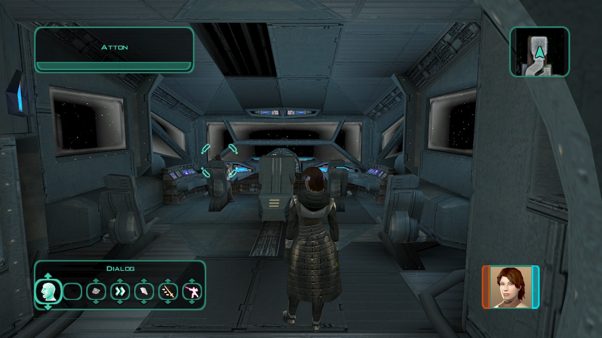

# Telos - Czerka excavation site

[< Previous Page](./13_Telos.md) |
[Back to the Index](../index.md) |
[Next Page >](../04_Dantooine/01_Dantooine.md)

- Party
  - What's with T3?
  - You did what while you were connected?
  - You downloaded Atris' archives?
  - He said there was a holo record of my trial in Atris' records.
    - I came because I chose to, not because you summoned me.
    - If you seek to punish me, then get on with it.
  - Those last few moments after my trial... I had no idea.
  - I know it could take a while, but keep analyzing her archives.
  - In a second - what else was in the archive?
  - What about artifacts? Lightsabers?
  - She was obsessed with records. Why wouldn't she have a list?
  - That was a rhetorical question, sorry.
  - All right then. Play the missing Jedi.
  - MOD
    - **What happened to the other member of the concil?**
    - **So they're dead. But five of the Jedi who were on the Council that exiled me are still alive.**
      - KREIA: And we are walking into it. This is too convenient **to be anything but a trap.**
    - Be that as it may, we need their help against the Sith.

```txt
- make heads turns to each others
- fix missing voice lines T3
```


{[Gameplay Programmer: If the player is male, the Handmaiden walks on board.]}
{[Warp to 003EBO]}

Lightsaber!
- Bao-Dur
  - Atris and the Jedi Council took it from me.
  - Do you think I can't build one?
  - With the Jedi enclaves all destroyed, I don't know where to get the parts.
  - **Since when did you become an expert on lightsabers?**
- Atton & Bao (if Atton's infl sufficient)
  - Talk about the exile (woman)
- Atton & T3 then Bao
  - Utility droids tend to have a habit towards developing personality quirks.
  - That sounds like a good idea to me.
  - [T3-M4 has received a permanent +2 bonus to his Constitution.]
- SAVE

- Start with discussing with Bao
  - **Oh, now you want to talk about it?**
    - **Obviously it is.**
    - What is it?
    - **The Jedi served no one with inaction.**
    - **So you wanted revenge?**
    - **I detached myself from the frenzy of battle. It was impersonal.**
  - What are you talking about? -> LATER
    - So, why are you here?
    - I mean, why are you still here?
    - Even if you knew what was wrong with it, how would you know where to start?
    - It's all wires and switches to you, huh?
    - I told you, I'm not a Jedi.
  - Where did you pick up that remote, anyways?
    - What does it do, other than follow you around?
  - Do I have all the lightsaber parts I'll need? `-> emitting matrix and lens`
  - Do you have shields?
  - What are you doing?
- Talk to the droid
  - It's been a long time since the war. I'm surprised you're still functioning.
  - Never mind.
- HK-> 2nd repair
- T3
  - How's the Ebon Hawk?
    - Good job - glad to hear it. `a_givelight(1)&&a_influence_inc(8, 1)`
    - What about the astrogation system?
    - You locked it? Why did you do that?
    - Protect? Protect who? Under whose orders?
    - Why didn't they want anyone to know where the ship had been?
    - So the astrogation system was crippled to prevent learning where the Ebon Hawk had been?
    - But how did the Ebon Hawk come back from there if it was so dangerous? And why?
      - **... BASTILA!**
    - Friend of yours?
    - I don't understand why you were concealing that from me.
    - I understand. I didn't think you kept messages like that.
    - **Who was the person the hologram was talking about?**
    - Another missing friend? `-> Revan!`
    - What happened to your old friend? Why aren't you with him?
    - Because he could not take anyone with him. Even the woman in the hologram.
    - ...and he left you. I'm sorry, T3.
    - But you did help - you found us, T3. If we can stop the Sith... then there is hope after all.
    - Is that message what you were trying to hide?
    - So this help you came in search of - you came in search of me.
    - That message doesn't tell me where the Ebon Hawk came from.
    - But why don't you have that information?
    - Deleted? By who?
    - You deleted it? Why?
    - This is impossible. You deleted it, you don't know why, and all you can show me is this old hologram as an "explanation?"
    - Don't be sorry - maybe you had a good reason, or were trying to protect someone.
    - Never mind. I'll be going now.
  - **[Computer] Mind if I try to upgrade your memory core again?** `!c_influence_bet(8, 30, 70)`
    - [Computer] All right. Let me take a look. `!c_sc_com_lt(15)`
    - That should up your processor speed. `Intelligence++`
    - Blank look? What, me? I was working on you this whole time.
    - I had other questions for you.
  - **[Repair] Ready for some more routine maintenance?** `!c_influence_bet(8, 30, 70)`
    - [Repair] I'll try and make this quick. `!c_sc_rep_lt(15)`
    - All done with the response package. Give it a spin.
    - [Due to your repair skills, T3's response systems have improved, giving him +1 Dexterity.]
    - No, I'm fine. I guess I just caught up in my work.
- Nothing else to do with T3 -> Repair >= 21 and Computer >= 21 still too low
- Atton
  - I had some questions for you.
    - Care to explain where you got your Echani training?
    - When we entered the Telos Academy, you dropped into an Echani combat stance.
    - I was just asking - no harm meant. I just thought it could be an asset. `a_givelight(1) + a_influence_inc(1)`
    - Never mind.
- Kreia
  - Yes, and I need some answers.
    - Kreia, what are you - are you a Jedi, a Sith?
      - [Intelligence] Then what were you? `c_ac_int_gt(13)`
      - If the past is as important as you claim, then I would hear yours. `a_global_set("000_Kreia_Movie", 2)&&a_playkremov01()`
      - I need more than that, Kreia.
      - I had other questions.
      - +1000 XP
    - Did you know Atris at all?
      - What do you mean?
      - You walked her path?
      - **You trained Revan?**
      - Never mind. I'll be going now. +500 XP





[< Previous Page](./13_Telos.md) |
[Back to the Index](../index.md) |
[Next Page >](../04_Dantooine/01_Dantooine.md)
