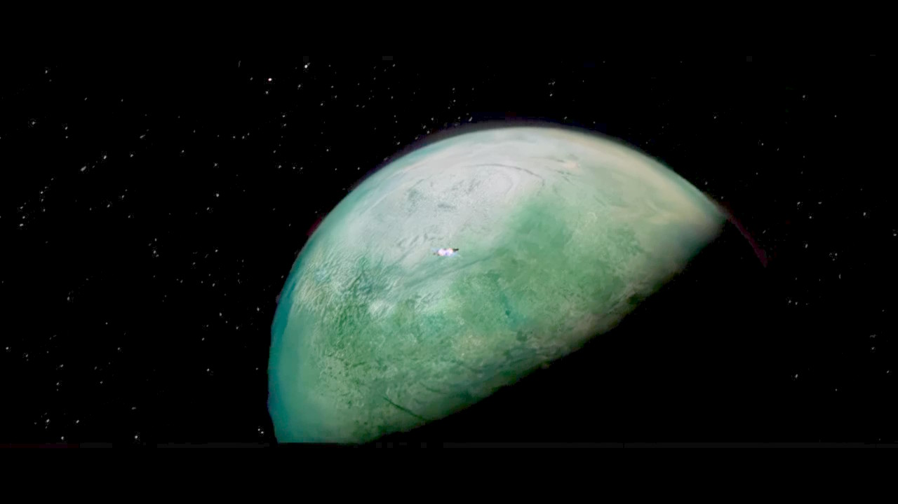
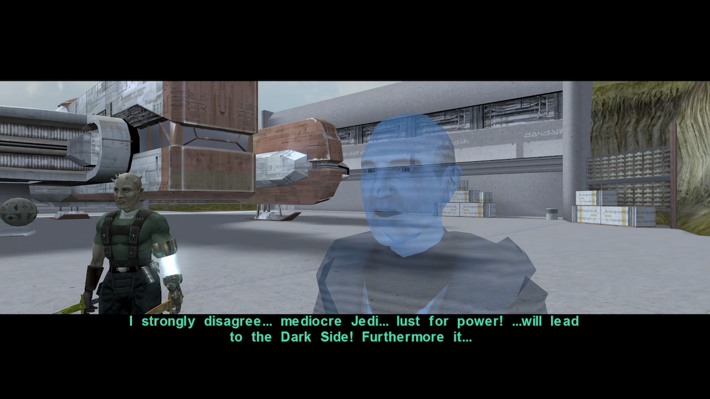
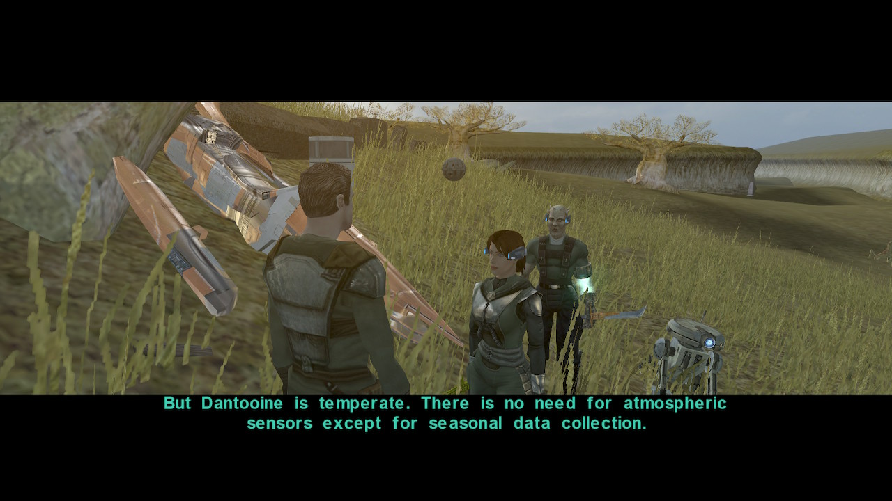

# Dantooine

[< Previous Page](../03_Telos/14_Telos.md) |
[Back to the Index](../index.md) |
[Next Page >](./02_Dantooine.md)



- Go out with Bao and T3! -> Kreia will intervine -> not much sense given the answer of Dillan
- Dillan
  - What are you talking about?
  - Hey, my ship is not banged up!
  - **I'm just visiting. I lived here once.**
    - // INTERESTING ALT WITH MIRA (not yet in the group)
    - {snorts}So you used to be a farmer? ...
  - Yes, but much has changed since I was last here. <- your answer
    - //I haven't been back since I left for the Mandalorian Wars. <- more coherent with reply
  - Where is Khoonda?
    - This is your center of government?
    - I'd be more impressed if there weren't so many holes.
  - Why do I need permission to enter the Enclave?
  - Who is Administrator Adare?
  - I'll be going now.
- Level up Bao and T3??
- Bao as a melee knight
- Droid "Greetings and good day, traveler. On behalf of the Khoonda settlement I am programmed to welcome you to Dantooine."  + `BaoDur` baneter
  - That's very observant of you, T3! `a_influence_inc(8, 1)`
  - Droid, what happened to damage you?
  - Sith invasion?
  - **[Computer] Droid, run a self diagnostic and report.** `c_sc_com_gt(1)`
  - [Repair] Fix the droid's memory unit. `c_sc_rep_gt(5)`
  - No, you must be mistaken.
  - [Persuade] The droid is obviously malfunctioning. Do I look like a Jedi? `c_sc_per_gt(7)&&c_lightsaber_eq()`
  - Why do you hate the Jedi?
  - Can you be more specific?
- Reask the droid
  - Why did you call me a Jedi?
    - Tell me about the invasion.
    - What do you know of me specifically?
    - Is that all?
    - Tell me more.



  - What can you tell me about Dantooine?
    - **Salvage?**
    - So, you can just walk into the ruins and take anything you wish?
    - What do you know of the ruins?
    - Tell me about how the Enclave came to be ruined.
    - I want to talk about something else.
  - What are the local areas of interest?
    - Why is that?
    - Where is the Khoonda outpost?
  - Is there any work available here?
    - I want to talk about something else.
  - Why were you walking in a circle?
  - I'll be going now.
- Pato Ado
  - What are you doing on Dantooine?
  - **How did the planet lose its balance?**
  - What's so unusual about the kinrath's behavior?
  - Why are you anxious to leave Dantooine?
  - I'm not interested right now. Maybe later.
- Loot around

```
Jal Shey Perception Gloves
```

- Old man -> don't ask why so busy yet -> useful later when recruting + infl
  - I am not a salvager.
  - I've come to see the Enclave.
    - What do you know about the Enclave?
    - I want to talk about something else.
  - Tell me about the salvagers.
    - I want to talk about something else.
  - What are the mercenaries doing here?
    - There's a Jedi here?
    - Who are "they"?
- Akkere
  - **Every trader says they're honest. Especially the dishonest ones.**
  - What do you sell?
  - Yes, T3. I'm sure he has upgrades you can use.
  - Why are you here?
    - Who is Zherron?
  - What can you tell me about Dantooine?
    - Have the mercenaries hurt anyone?
    - Why are the salvagers trouble?
  - I'll be going now. -> see inventory later
- Guard
  - try to open the door
- Dilan again
  - Tell me about the admin
  - Why are there so many mercenaries here?
  - Have the mercenaries caused any problems?
  - Who has disappeared?

Khoonda - SAVE

- Reception
  - Why does everyone think I'm a salvager?
  - What do you have in Khoonda?
    - Where can I find the weapon shop?
    - Why would I need to see Zherron?
    - Recent problems? Like what?
    - Could you go into more detail?
    - Where can I find Zherron?
    - What exactly is Khoonda?
    - It's not a very big building for a center of government.
    - I'd like to ask you about something else.
  - Where is the Administrator?
- Suulru `Possible banters: ['Mand', 'Handmaiden', 'Kreia', 'Disciple']`
  - Why not?
  - What exactly is your problem?
  - The salvagers stole your equipment?
  - Are you sure it's a salvager?
  - What did they steal?
  - Why doesn't the Administrator help?
  - Is there anything I can do to help?
  - **If you want my help, you'll have to cough up more than a couple of dusty old war trophies.**
  - I'll see what I can do.
- Turn right
- Berum Modrul
  - Gerevick?
    - Who is Gerevick?
    - I've had no problems the militia needs to worry about.
    - Isn't being hands-on a good thing?
    - Can't anyone do something about it?
    - What makes you suspicious?
    - Seems like Dantooine has had a lot of trouble.
    - I might cause some trouble of my own, actually.
    - I've got a few questions about the other people here in the settlement.
  - I've heard rumors there's a Jedi around here.
    - Do you know if the rumor is true?
    - If no one says anything on their behalf, the rumor can feed on itself.
    - [Persuade] If good men say nothing then the Dark Side triumphs. -> nothing more to say
    - I've got a few questions about the other people here in the settlement.
  - I wondered if you knew anything about Suulru's problem.
- Got back to the Admin room
- Adum
  - **Selling arms, right?**
  - I would like to ask you some questions.
  - How long have you been here?
  - What do you know about the mercenaries?
  - Why are there so many kinrath and kath hounds around?
  - Nice banter - you try the same line on everyone?
- Zherron + ASK ABOUT MORDRUL!
  - I've had a spot of trouble, yes.
  - Just exploring and getting to know people.
    - What sort of work do you have? **CHECK THIS -> INFINITE XP BUG IF NOT ASKING**
    - Why is this place so overrun with kinrath?
    - How dangerous is it?
    - How much is the reward?
    - [Persuade] With so few settlers, lives are much more important than credits. -> always fail
    - What do you know about the cave?
    - I'll see what I can do.
  - What's Gerevick's connection to the militia?
  - Can I ask you some general questions?
    - How is the militia doing?
    - What do you know about the Administrator?
    - Could you tell me about Khoonda?
    - How do you feel about the mercenaries?
    - I'd like to ask somehting else
  - Berun asked me to investigate you.
    - He's concerned that you might provoke the mercenaries.
    - [Persuade] I think he's wrong, and I think I can help you. `c_sc_per_gt(10)`
- Admin
  - It's a pleasure to meet you. I'm <FirstName>.
    - **Why do you want to know?**
    - I'd prefer if you keep that quiet, Jedi don't seem to be liked here. Or practically anywhere these days.
    - What do you mean by that?
    - [Persuade/Lie]: He sent for me. He said you'd fill me in on the situation when I arrived.
    - Go on.
    - I actually came here to search the Enclave ruins, anyway.
  - **What are the dangers of the sublevel?**
  - **What was Master Vrook doing for you?**
    - Could you tell me anything more?
  - Is there any work I can do here?
  - Do the people of Dantooine really hate the Jedi?
    - Can anything be done about it?
  - What can you tell me about the people of Dantooine?
    - I'd like to know about the settlers.
      - [Awareness] You don't seem convinced by that. `c_sc_awa_gt(5)`
    - What are salvagers doing on Dantooine?
      - And you coexist happily with them?
      - What are you going to do when the ruins are empty?
    - What about the mercenaries?
- Gerevik
  - My ship isn't battered. -> miso soup
- Will not talk to you
- Leave
- Loot behind building
- Go east -> kill kinrath
- Old man
  - Kinrath?
    - Why have things gotten so bad?
    - What do you need from the Republic?
  - What do you need from the Republic?
    - **Do you suspect foul play?**
    - Why do you really want those sensors?
    - Any idea where they could be?
    - I'll see what I can do.
- North - SAVE



MERC
- Dopak
  - You don't think I'd make a capable mercenary?
  - Do you know anything about a thief? `<tbt`
  - Can you tell me about the mercenaries?
    - Who's your leader?
    - Why haven't you been able to line up a job?
    - So what do you do when you're between jobs?
    - Can we talk about something else?
  - What do you think about Dantooine?
    - Why choose Dantooine as your base?
    - What are you planning to do?
    - What about the settlers?
    - What do you think about the Administrator?
    - Can we talk about something else?
  - I heard you've been making trouble for the settlers.
    - They're also pathetic. I think you have the right idea.
    - I'll be going now.
- Esok
  - What are a bunch of Mandalorians doing on Dantooine?
  - ... // if Dxun -> Mandalore
- Nallek
  - I have no problem with you.
  - I heard the Administrator runs this planet.
  - [Persuade] I'm not here to cause trouble. I'm a warrior like yourself. `c_sc_per_gt(10)`
  - Which side were you in the war?
  - Why did you want to fight me?
  - What are you mercenaries up to?
  - [Force Persuade] You want to answer my question. `c_mind_trick()` <- needed
  - **Any idea who you are working for?**
- he leaves
- Dopak
  - I have a message for you. From Zherron.
  - The message is just for you.
  - Do you know what this about? Zherron wouldn't tell me.
  - He says, "Go ahead."
- Kill the wild animals -> tough!

- Daraala `140% too expensive...` https://strategywiki.org/wiki/Star_Wars_Knights_of_the_Old_Republic_II:_The_Sith_Lords/Items
  - .. technically i am
  - Why don't you think I will find anything?
  - Surely there's something left.
  - Why won't anyone help me?
  - I don't need your permission to go to the ruins.
  - I already have that.
  - I'm going to the ruins. I've come a long way.
  - [Awareness] That seems unusually generous of you. `c_sc_awa_gt(10)`
  - What do you do around here?
  - Who do you sell it to?
- Ask later for her inventory
- Ralon `Kreia banter but not very useful`
  - Credits and curiosity? Are you selling something?
  - **Fabled and powerful? Isn't that an exaggeration?**
  - Can I inspect the holocron? Maybe it's broken.
  - That *is* a remarkable fake, but it's not even worth the time you've wasted describing it.
  - That's all you can say?
  - I thought this was a "delightful camp".
  - So you didn't make this?
  - Wife and children?
  - Do I look that gullible?
  - Do you know anything about a thief? `-> ask Darala -> after turning back`
  - Can you tell me about the planet?
    - What are the settlers like?
    - What are mercenaries doing on Dantooine?
    - What can you tell me about the salvagers?
- Kreia
  - So the Jedi still live? `does make sense..?`
- Kill HK-50
- Kill animals
- Taepalae
  - What's the problem?
  - Where is he? I might be able to save him.
  - What can you tell me about laigreks?
- Come back to prepare for the enclave
- Talk again with Taepalae -> no sound on voice
- Darala from behind `> this conversation should be held before. So reask (TSLRCM). She mention Ralon and tel her opinion`
  - Have you heard anything about a thief around here? `missing lips?`
  - Who do you think the thief is?
  - Why haven't you tried to tell Suulru?
  - The thief comes from the ruins?
  - I'm going to the ruins. I've come a long way.
- Back
- Kill animal
- SHould be close to lvl 14
- To the ship. Don't enter
- Remove party -> to play pazaak!
- Pato Ado - Pazaak addict!
  - Ask for 750c play until he's broke (tested 4x! 3000c) -> if doesn't ask start a free game and cancel
  - the armor
- Back to the ship SAVE


[< Previous Page](../03_Telos/14_Telos.md) |
[Back to the Index](../index.md) |
[Next Page >](./02_Dantooine.md)