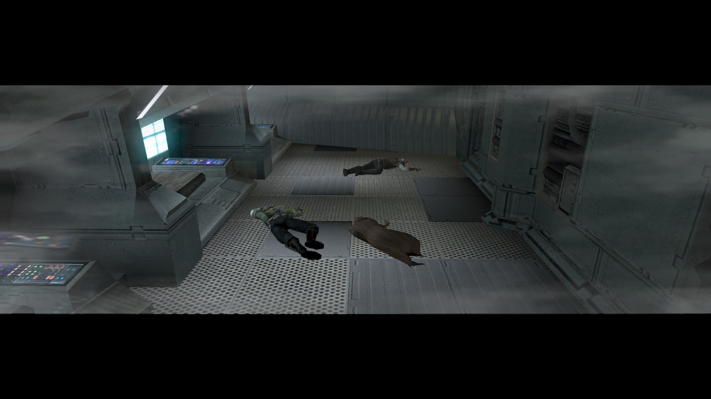
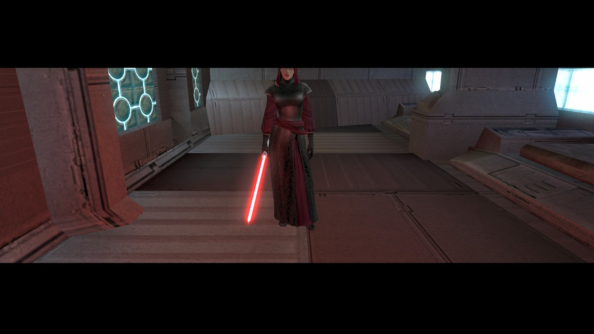
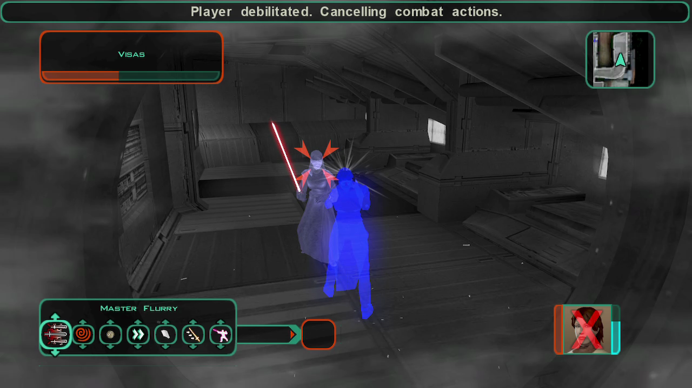
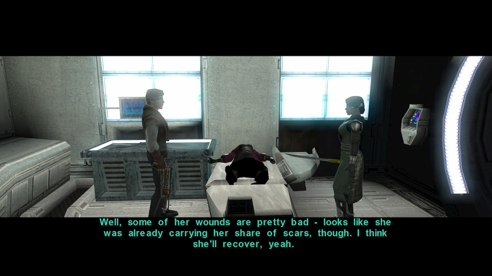

# Dantooine - A silent invasion

[< Previous Page](./01_Dantooine.md) |
[Back to the Index](../index.md) |
[Next Page >](./03_Dantooine.md)

- Visas
  - What have you done to the crew?
- .. FIGHT ... use shields and stimulants with the pause menu

- Visas
  - **I will not kill you.** `a_givelight(1)`
    - Look, you're wounded. Stand, let me get you to the medbay. `a_givelight(1)`
  - What's a Miraluka?
    - Maybe she knows.
    - See through the Force?
  - Is her kind rare?
    - **Killing one?**
  - Is she going to be all right? `a_givelight(1)`
  - If her condition changes, let me know - I didn't want to hurt her. `a_givelight(1)`

- Grabbed emitter
- HK repair
- Kreia -- **required: `c_ac_int_gt(14)` or `c_ac_int_lt(15)+c_sc_awa_gt(14)`**
  - I don't understand how she tracked us down.
    - **Ties to her master, perhaps. And I intend to follow that bond to its source when the opportunity presents itself.** `a_influence_inc(6, 2)`
    - Atton said her planet was wiped out, that it was the only colony of her people in this sector of the galaxy.
    - [Awareness] Well, if her people all see through the Force, then maybe someone wanted to blind them. `c_ac_int_lt(15)+c_sc_awa_gt(14)`
    - [Awareness] Someone wants this sector of the galaxy blind to the Force. So they can move freely... or strike without warning. `c_ac_int_lt(15)+c_sc_awa_gt(14)`
    - I had other questions.
  - When Visas attacked, she did something to my eyesight.
    - What?
    - All right.
    - [Computer Use] Hey, T3 has a stuck motivator.
    - [Repair] Hey, I can hear a catch in it. It's not fully fixed.
    - [Awareness] I heard her thoughts. `c_sc_awa_gt(10)`
    - But... how did I do that? `a_addforcepoints(6)&&a_adjust_skill(3, 1)`
    - [You have gained +1 Awareness and recovered some of your connection to the Force.]
- Level up! 14
- Go to Visas `Wisdom >= 16`
  - **Are you all right?** `a_givelight(1)&&a_influence_inc(9, 1)`
  - That's not what I asked. I asked if you were all right.
  - **In medbay, I... we... noticed you have scars. Who hurt you?** `a_givelight(1)&&a_influence_inc(9, 1)`
  - How did you find me?
  - Who sent you?
  - I need to know where I can find your Master.
  - Ready?
  - **My life is unimportant - your Master threatens more than just me.** `a_givelight(1)&&a_influence_inc(9, 1)`
  - **If he is behind what has befallen the Jedi, then he must be stopped.** `a_givelight(1)&&a_influence_inc(9, 1)`
  - Why are you doing this for me?
  - If your master has trouble detecting me, how are you able to do it?
  - // AFTERWARDS -> Where are your people, your world, now? `!c_influence_bet(9, 31, 69)`
  - Was your Master the one sent to Peragus?
    - // What do you mean? // -> same as next
    - Forget it. I had some other questions for you.
  - Was your Master behind the destruction of Peragus?
    - Forget it. I had some other questions for you.
  - I have heard your species is blind. How are you able to see?
    - You sound as if that sight is lost to you. `!c_influence_bet(9, 20, 80)`
    - **When one endures, it gives hope to others - and themselves.** `a_lightsml();a_influence_inc(9, 1)`
  - How do you see through the Force? `!c_influence_bet(9, 10, 90)`
  - Never mind. I'll be going now.
  - **Because I believe you can be saved.** `a_lightsml();a_influence_inc(9, 3)`
  - **To help another is not weakness - it is strength to them both.** `a_givelight(1)`
  - What do you mean?
  - Tell me about your homeworld. -> same as before...
    - **I have seen similar acts of destruction... at Malachor.**
    - How was it destroyed?
    - If your homeworld was destroyed, how did you survive?
    - ...as if everything suddenly went silent.
    - You were the only survivor?
    - He made you see?
    - And why did your Master show you this?
    - I don't understand - it would have taken several Republic cruisers to destroy the surface of Katarr.
    - Why did your Master destroy Katarr?
    - Why did the Jedi meet on Katarr?
    - He attacked it because the Jedi had gone there?
    - [Wisdom] Or it may starve him... make him more desperate. `c_ac_wis_gt(15)`
    - Just thinking out loud. Why did the Jedi meet on Katarr?
    - Forget it. I had some other questions for you.

- Workbench -> create for against bio (energy protection won't be much)
  - Balistic overlay II
  - Restoration II
- Leave with Kreia and T3 (infl+ with droids repaired -- to be fixed)
- Go to the sublevel of the enclave

[< Previous Page](./01_Dantooine.md) |
[Back to the Index](../index.md) |
[Next Page >](./03_Dantooine.md)