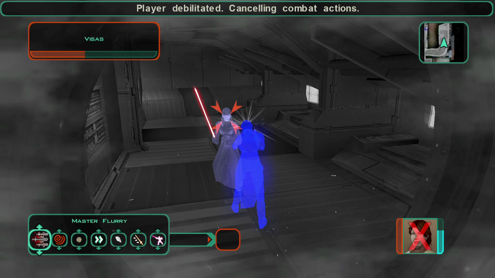
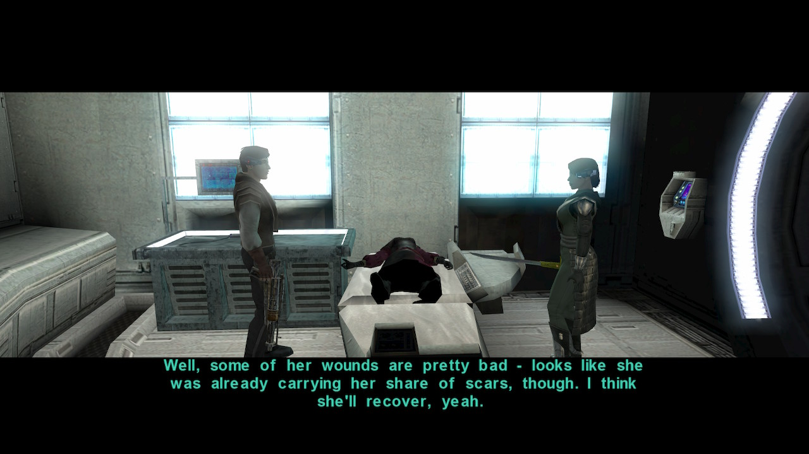

# Dantooine - A silent invasion

[< Previous Page](./02_Dantooine.md) |
[Back to the Index](../index.md) |
[Next Page >](./04_Dantooine.md)

- Visas
  - What have you done to the crew?
- .. FIGHT ... use shields and stimulants with the pause menu

- Visas
  - **I will not kill you.** `a_givelight(1)`
    - Look, you're wounded. Stand, let me get you to the medbay. `a_givelight(1)`
  - What's a Miraluka?
    - Maybe she knows.
    - See through the Force?
  - Is her kind rare?
    - **Killing one?**
  - Is she going to be all right? `a_givelight(1)`
  - Let me know when she awakens. I have questions for her.
    - NOT NECESSARY: If her condition changes, let me know - I didn't want to hurt her. `a_givelight(1)`

- Grabbed emitter
- **Bao becomes a Jedi**
  - Maybe it's because I stopped wearing that boring Republic uniform.
  - What about me, for giving the order?
  - **If Ulic Qel-Droma could be forgiven for waging war against the Republic, you can be forgiven for saving it.**
  - You did it to save us, to protect us from death.
  - You have dwelled in the past for too long. You cannot undo history, but you can change the future.
  - If you will let me teach you, the Force can become your shield. I believe you could learn to become a Jedi.
  - Then we have no time to waste.
- Kreia -- **required: `c_ac_int_gt(14)` or `c_ac_int_lt(15)+c_sc_awa_gt(14)`**
  - I don't understand how she tracked us down.
    - **Ties to her master, perhaps. And I intend to follow that bond to its source when the opportunity presents itself.** `a_influence_inc(6, 2)`
    - Atton said her planet was wiped out, that it was the only colony of her people in this sector of the galaxy.
    - [Awareness] Well, if her people all see through the Force, then maybe someone wanted to blind them. `c_ac_int_lt(15)+c_sc_awa_gt(14)`
    - [Awareness] Someone wants this sector of the galaxy blind to the Force. So they can move freely... or strike without warning. `c_ac_int_lt(15)+c_sc_awa_gt(14)`
    - I had other questions.
  - When Visas attacked, she did something to my eyesight.
    - What?
    - All right.
    - [Computer Use] Hey, T3 has a stuck motivator.
    - [Repair] Hey, I can hear a catch in it. It's not fully fixed.
    - [Awareness] I heard her thoughts. `c_sc_awa_gt(10)`
    - But... how did I do that? `a_addforcepoints(6)&&a_adjust_skill(3, 1)`
    - [You have gained +1 Awareness and recovered some of your connection to the Force.]
- Go to Visas
  - **Are you all right?** `a_givelight(1)&&a_influence_inc(9, 1)`
  - That's not what I asked. I asked if you were all right.
  - **In medbay, I... we... noticed you have scars. Who hurt you?** `a_givelight(1)&&a_influence_inc(9, 1)`
  - How did you find me?
  - Who sent you?
  - I need to know where I can find your Master.
  - Ready?
  - **My life is unimportant - your Master threatens more than just me.** `a_givelight(1)&&a_influence_inc(9, 1)`
  - **If he is behind what has befallen the Jedi, then he must be stopped.** `a_givelight(1)&&a_influence_inc(9, 1)`
  - Why are you doing this for me?
  - If your master has trouble detecting me, how are you able to do it?
  - Where are your people, your world, now? `!c_influence_bet(9, 31, 69)`
    - **I have seen similar acts of destruction... at Malachor.**
    - How was it destroyed?
    - If your homeworld was destroyed, how did you survive?
    - ...as if everything suddenly went silent.
    - You were the only survivor?
    - He made you see?
    - And why did your Master show you this?
    - I don't understand - it would have taken several Republic cruisers to destroy the surface of Katarr.
    - Why did your Master destroy Katarr?
    - Why did the Jedi meet on Katarr?
    - He attacked it because the Jedi had gone there?
    - [Wisdom] Or it may starve him... make him more desperate.
    - Forget it. I had some other questions for you.
  - Was your Master the one sent to Peragus?
    - // What do you mean? // -> same as next
    - Forget it. I had some other questions for you.
  - Was your Master behind the destruction of Peragus?
    - Forget it. I had some other questions for you.
  - I have heard your species is blind. How are you able to see?
    - You sound as if that sight is lost to you. `!c_influence_bet(9, 20, 80)`
    - **When one endures, it gives hope to others - and themselves.** `a_lightsml();a_influence_inc(9, 1)`
  - How do you see through the Force? `!c_influence_bet(9, 10, 90)`
  - Never mind. I'll be going now.
  - **Because I believe you can be saved.** `a_lightsml();a_influence_inc(9, 3)`
  - **To help another is not weakness - it is strength to them both.** `a_givelight(1)`
  - What do you mean?
  - Tell me about your homeworld. -> same as before...
- Leave the ebon -> if enough xp for BAO -> IMPORTANT -> Free level gifted!
- Level up Bao -> 12
- Back to the Ebon
- 2 Cutscenes
  - Kreia angry against T3 -> cause he told you about Bastila
  - Atton and Bao about the Exile

- Leave the Ebon with Kreia and Bao
- Level 13 Bao 66000 -> 78000 XP for free!

- Kaevee
  - What are you doing down here?
  - Who are you?
  - [Awareness] I sense you have a connection to the Force.
  - Why be a Jedi? They're a lost cause.
  - You can forge your own path. Free of rules.
- All the parts for a light saber! Wait for workbench
- Jorran
  - Could you open the door?
  - Are you Jorran?
  - There are still some laigreks around.
- Kill the closest laigrek
- Jorran
  - TO BE ADDED: Do you know anything about a thief?
  - The laigreks in this area are dead.
    - Before you go - what were you doing down here?
    - Why were you down here if it's so dangerous?
      - Almost nobody...? Who's the almost?
      - How did they die?
      - How can dead people cause problems?
      - Daraala had me looking for their bodies. To lay them to rest.
      - Her deceit won't gain her anything.
      - I want to talk about something else.
    - Did you find anything down here?
      - I know you found something. Taepalae told me.
      - Any chance you could give me what you found as a reward?
      - Could I buy them off of you?
      - Can I see what it is first?
      - I'm afraid I don't have that kind of money. -> 1000c later instead of 1300c
- Droid room -> repair all with Bao -> kill the laigrek!
  - Leave some space between droids -> will explode

- Historian
  - I wasn't expecting to find anyone else here... alive.
  - What are you doing here?
    - [Awareness] That's not the only reason. `c_sc_awa_gt(11)`
    - Left?
    - What others?
    - You mentioned holocrons? `Atris took them...`
    - Why is that?
  - Do you know what happened to the Jedi?
    - Why do you think people hate the Jedi?
    - But Jedi have protected the galaxy for centuries - they seek peace, often through sacrifice.
    - Do you hate the Jedi?
    - What do you mean?
    - I was one of those Jedi. I must accept part of that responsibility.
    - Revan and Malak would have received the same training as I did.
    - Go on.
    - **Do you know who trained Revan?** `Kae -> Kreia!`
    - I want to talk about something else.
  - Why do you work for the Republic?
    - Why Telos and Onderon?
    - And Onderon?
    - **Why is Dantooine important?**
      - alt: Why are the Jedi Order important?
  - Tell me about the Republic.
    - What happened?
    - What do you mean?
  - You look familiar to me. `they met before..!`
  - I'll be going now.
  - The Sith are awake in the galaxy, and I'm going to need their help to stop them.
  - Trust me, the Sith are out there. They've been hounding me since Peragus.
  - We would welcome your company.
- Loot mercenaries -> ordered to find Vrook
- Will->
  - Don't change the will
- Before leaving
  - I don't suppose you'd like to negotiate a peaceful resolution to this situation?

Back to the camp
- Jorran
  - How much do you want for the Jedi artifacts? -> now it's only 1000c!
  - Can I see them?
  - I'm afraid I don't have that kind of money. -> not buying. Just a crystal that is interesting

LATER
- Ahrnell
  - My apologies.
  - I'm just exploring. What are you doing?
  - [Awareness] You are different from most of the mercenaries I've met. `c_sc_awa_gt(11)`
  - You mentioned crystals?
  - [Awareness] The energy you speak of is the Force. I sense some small Force potential within you.
  - I am a Jedi.
  - What do you know about the other mercenaries
  - Why do they keep you out of the loop?
  - Why do you get special privileges?
  - [Persuade] I am an explorer, like you. You can share your secret with me. `c_sc_per_gt(11)`
  - Do you have an extra scent gland I could use?
  - [Persuade] I want to hold your gland.
  - Okay, you can have it back.
- Right to crystals
- Kreia
  - You said the crystals absorb the Force? I feel strange, but not weaker.
  - Tell me more about these crystals.
  - I don't like the idea of leaving behind evidence.
  - Okay.
- Crystal
  - I don't need this. Do you want it?
  - Bah, I've gained a pet crystal. I hope I don't have to feed it.
  - What makes this crystal so special?
  - Is the bond... dangerous?
  - Does the crystal feed off of the Light Side of the Force?
  - Okay.
- Mercenaries
  - So the mercenaries are branching out into kidnapping now?
  - Can I ask you a question?
  - Can we work out some sort of deal?
  - Defend yourselves
- Vrook
  - Always a pleasure, Vrook. I see you still have your cheery disposition.
  - Is this the same "careful timing" you were counting on in the Mandalorian Wars?
  - Revan and Malak were misguided, but without them we'd all be speaking Mandalorian.
- Back
- Sensors
  - What's the problem? We found the sensors. Now we can take them to Saedhe and get paid.
  - [Awareness] Can you examine one of the sensors? `c_sc_awa_gt(4)`
  - Good work Bao-Dur. `a_influence_inc(1)`
- Akul ambush (DS -> possibility for infl+ on Kreia or HK but not yet)
  - What do you want with me?
  - What's in it for me?
  - What do you have in mind?
  - So, you want me to destroy the gun turrets?
  - What about the traps?
  - [Lie] Okay, I'll help you.
  - I'm not interested.
- Saedhe
  - Actually, I've found three of them.
  - Not so fast - we found a little surprise inside them.
  - Why is there surveillance equipment in the sensors?
  - 5000 credits sounds good to me.

- Ebon?
  - Disciple
    - _{Gameplay Programmer: This cut scene takes place on the Ebon Hawk, the Disciple is studying a series of holographic worlds in the center of the ship.}_
    - _{Gameplay Programmer: The player walks up to the Disciple, studies the worlds with him.}_
    - What are you studying?
    - It is difficult to turn away from the suffering of others - that is why one must help when they can.
    - [Awareness] There's something about the worlds themselves, isn't there? `c_sc_awa_gt(12)`
    - Are you sure you have no idea?
    - I would let it rest - thinking too hard about it will not make the answers come any easier.
  - Bao
    - I wanted to teach you some of the techniques I've learned in my travels. `a_bao_teach(176)`
  - Kreia -> master class
    - It was Visas' Master - he can feel my presence in the Force.
    - Jedi Watchmen should return to the galaxy, and I will be the first to restore them.
      - _From here on, you guide your destiny. But in order to take the next steps, **you must face your past and put it to rest**._
      - `she suggests you to go to Korriban`
  - Disciple
    - Well, I hope our enemies think so.
    - I thank you for your kind words, but they are not necessary. `a_givelight(1)`
    - I had other questions.
    - What do you do again?
    - What are you doing for the Republic?
    - Why did they choose you?
    - Do you know what happened to the Jedi?
    - The Jedi never knew the common people - especially when the common people were dying at the hands of Mandalorians.
    - **But Jedi have protected the galaxy for centuries - they seek peace, often through sacrifice.** `a_givelight(1);a_global_set("000_Disc_Jedi_React", 1)`
    - Do you hate the Jedi?
    - Nothing, never mind.
      - And why do you want to discuss it?
      - I left to protect the innocents on the Outer Rim. `a_givelight(1)`
      - That was my belief, but recent discoveries seem to indicate there may have been other causes.
      - T3-M4 has a copy of it.
      - I trust you - go ahead. `a_influence_inc(11, 1)`
    - INTERESTING: if T3 in the group, he should ask directly
  - HK
  - Kreia - complaining about the number of people gathered
    - As many as want to come with us and help us.
    - What makes you think they obey me?
    - Does the fact they obey me upset you?
    - **I've noticed their behavior is changing - Atton, especially.** `!c_influence_bet(6, 40, 60)`
    - **And what about you?**
    - They are my friends, not tools.
    - What do you mean? `!c_influence_bet(6, 35, 65)`
    - He was a powerful presence - there was little one did not believe when he spoke it with conviction.
    - I thought teachings of the Sith came from Korriban.
    - Never mind. I'll be going now.
  - Kreia questions
    - Can you tell me about the <FullName> Crystal?
    - `CANCELED -> same above` I had questions about how Revan amassed such a huge force against the Republic. `!c_influence_bet(6, 35, 65)` 
    - Did you know Revan?
      - Where did Revan come from?
      - What else do you know of Revan?
      - What caused Revan to fall, to turn on the Republic?
      - Then what made him turn to the Dark Side, become a Sith Lord?
      - **You trained him?** `!c_influence_bet(6, 10, 90)` `a_global_set("000_Kreia_Revan_XP", 1);a_influence_inc(6, 3)`
      - What was Revan like as a student?
      - What do you see when you look at me?
      - Never mind. I'll be going now.
  - Kreia -> ask force -> talk about Atton
  - Atton -> playing paazak etc
    - [Repair] There are no ticks in the power coupling - it's fixed. `c_sc_rep_gt(3)`
    - I don't want to play pazaak.
    - This better not be using Nar Shaddaa rules.
    - If it's a friendly game, sure.
  - Play pazaak
    - I was trying to compute the totals to twenty.
    - **Atton, before, I felt your mind. With Kreia's help. I'm sorry.** `a_influence_inc(1);a_global_set("000_Atton_Pazaak", 90)`
    - What do you have to hide?
    - Is that something you can train me to do?
    - No - I want to learn to shield my mind.
    - Then I want to learn to play pazaak.
    - [Atton has taught you to play pazaak in your head as a way of resisting mental domination. You have gained a permanent +1 to your Willpower saves.]
  - Kreia
    - Skill
    - Very well. I shall take this lesson to heart.
- Old man -> with Kreia and Atton?
  - I am not a salvager.
  - I've come to see the Enclave.
    - What do you know about the Enclave?
    - I want to talk about something else.
  - Tell me about the salvagers.
    - I want to talk about something else.
  - What are the mercenaries doing here?
    - There's a Jedi here?
    - Who are "they"?
  - Why so busy?
    - [Awareness] It sounds like you have a lot on your shoulders. `c_sc_awa_gt(11)`
    - [Persuade] You shouldn't keep your frustrations bottled inside. `c_sc_per_gt(9)` `a_influence_inc(6, 1)&&a_local_set(55)` -> Kreia! + Atton
    - You're having trouble with the droids?
    - What's wrong with the doors?
    - Tell me about the turrets.
    - I'll be going now.
- Adare
  - Who knows about the attack?
  - What can I do to help?
  - Can you give me anything to help?
  - I'll check out Khoonda's defenses then.
- Speak to Vrook
- Speak to Zehron
  - How much time do I have?
  - What kind of things need fixing?
  - What's involved with finalizing the defenses?
  - I'm going to see what I can do.

[< Previous Page](./02_Dantooine.md) |
[Back to the Index](../index.md) |
[Next Page >](./04_Dantooine.md)