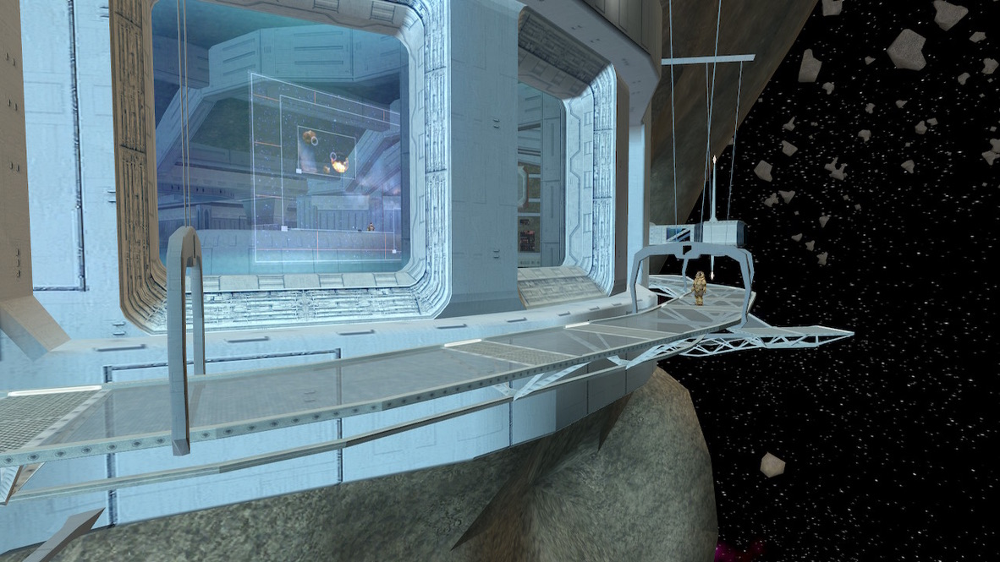
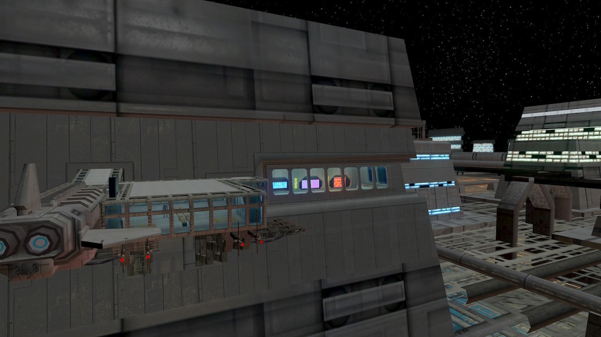
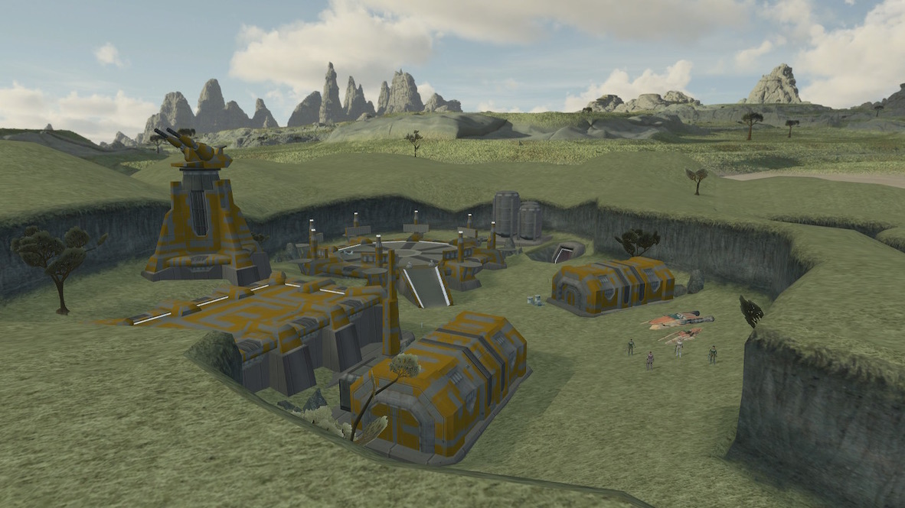

# Knights of the Old Republic II - Guide Index

[< Back to the README](../../README.md)

## Before playing

1. [Modding]()
1. [Leveling Guide](../leveling/Kotor2_Leveling.xlsx)

## Prologue

1. [Character Creation](00_Misc/010_CharacterCreation.md)
1. [Opening](01_Prologue/01_Prologue.md)
1. [Save the exile](01_Prologue/02_Prologue.md)
1. [Outside the ship](01_Prologue/03_Prologue.md)
1. [Repairing the engine](01_Prologue/04_Prologue.md)

## Peragus

1. [Waking up](02_Peragus/01_Peragus.md)
1. [T3-M4 comes to the rescue](02_Peragus/02_Peragus.md)
1. [Mining galleries](02_Peragus/03_Peragus.md)
1. [A talkative droid](02_Peragus/04_Peragus.md)
1. [Dormitories](02_Peragus/05_Peragus.md)
1. [Killing the murderer](02_Peragus/06_Peragus.md)
1. [On the harbinger](02_Peragus/07_Peragus.md)
1. [Reach the Ebon Hawk](02_Peragus/08_Peragus.md)
1. [Escape the station](02_Peragus/09_Peragus.md)
1. [Getting to know your companions](02_Peragus/10_Peragus.md)

## Telos

### Citadel station

1. [Getting arrested](03_Telos/01_Telos.md)
1. [Residential modules](03_Telos/02_Telos.md)
1. [Get back your equipment](03_Telos/03_Telos.md)
1. [Docking area](03_Telos/04_Telos.md)
1. [Working for the TSF](03_Telos/05_Telos.md)
1. [Droid delivery](03_Telos/06_Telos.md)
1. [Modified blaster investigation](03_Telos/07_Telos.md)
1. [Exchange cleanup](03_Telos/08_Telos.md)
1. [Compromising Czerka corp.](03_Telos/09_Telos.md)
1. [Before leaving the station](03_Telos/10_Telos.md)

### Telos surface

1. [Restoration zone C1](03_Telos/11_Telos.md)
1. [Footsteps in a droid factory](03_Telos/12_Telos.md)

### Telos Academy

1. [Beneath the frost](03_Telos/13_Telos.md)
1. [Conversations in the Ebon Hawk](03_Telos/14_Telos.md)

## Dantooine

1. [Back to where the exile grew up](04_Dantooine/01_Dantooine.md)
1. [A silent invasion](04_Dantooine/02_Dantooine.md)

## MISC

1. [LOOTS](00_Misc/XX_Peragus.md)
1. [DEV](00_Misc/XX_DEV.md)

